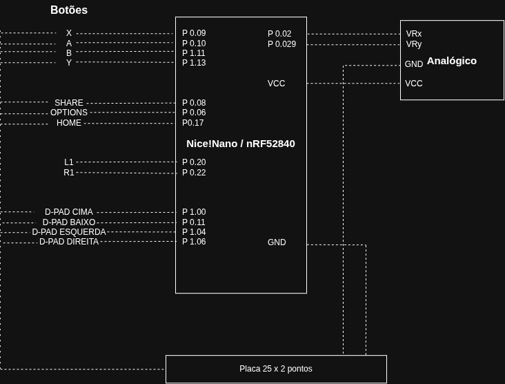

# Instruções de Montagem — Controle DACC Station

Este documento descreve o processo de montagem do protótipo funcional do controle desenvolvido para o DACC Station.

> As instruções abaixo correspondem à versão funcional baseada em Nice!Nano/nRF52840, utilizando **USB HID cabeado**, uma **placa com fendas para fixação dos botões** e uma **placa de ensaio de 25 × 2 pontos para distribuição do GND**.

---

## 1. Preparação e teste da carcaça

1. Imprima as partes da carcaça utilizando os arquivos disponibilizados no diretório `controle/modelos_3d/`.
2. Remova suportes e resíduos da impressão.
3. Teste os encaixes da parte superior e inferior da carcaça.
4. Teste os parafusos e confirme se o fechamento ocorre sem forçar as peças.
5. Verifique o encaixe da placa com fendas no sistema de **snap-fit**.
6. Confirme se os orifícios da parte superior coincidem com a posição dos botões e do joystick.

Realizar esses testes antes da montagem eletrônica evita a necessidade de desmontar componentes já soldados caso seja necessário algum ajuste na peça impressa.

---

## 2. Configuração da Nice!Nano

Antes da montagem física, configure a Nice!Nano utilizando o conteúdo do diretório `controle/nrf_module/`.

As instruções completas estão disponíveis em [`Instrucoes de configuracao.md`](Instrucoes%20de%20configuracao.md).

O firmware documentado configura o dispositivo como um **USB HID Gamepad**. Embora o nRF52840 possua suporte a Bluetooth, a comunicação Bluetooth HID não foi concluída na versão funcional apresentada neste guia.

> Recomenda-se testar a Nice!Nano conectada diretamente ao Raspberry Pi antes de iniciar a soldagem e a montagem definitiva.

---

## 3. Preparação da placa com fendas e dos botões

1. Posicione os **13 push buttons** na placa com fendas conforme a distribuição prevista pela carcaça.


2. Confira o espaçamento entre os botões utilizando a parte superior da carcaça como referência.
3. Fixe os botões na placa com fendas.
4. Solde um jumper/fio ao terminal de sinal de cada botão.
5. Prepare também os terminais negativos/comuns dos botões para conexão posterior ao barramento de GND.

A placa com fendas atua tanto como suporte das conexões quanto como elemento mecânico responsável por manter o alinhamento dos botões.

---

## 4. Preparação da Nice!Nano

Para reduzir a altura ocupada pela placa dentro da carcaça, dobre cuidadosamente os pinos laterais da Nice!Nano em aproximadamente **90° para fora**:

- os pinos do lado direito devem ser dobrados para a direita;
- os pinos do lado esquerdo devem ser dobrados para a esquerda.

Faça a dobra com cuidado para evitar esforços excessivos nas ilhas de solda ou nos terminais da placa.

Depois da dobra, posicione a Nice!Nano **no centro da parte inferior da carcaça**, verificando se:

- a placa não interfere no fechamento;
- os pinos permanecem acessíveis para os jumpers;
- a porta USB pode ser acessada externamente.

---

## 5. Diagrama de conexões



---

## 6. Conexão dos botões à Nice!Nano

Os botões utilizam entradas com `pull-up` interno. Portanto, cada botão é conectado entre um GPIO e o GND comum.

Conecte os jumpers soldados aos botões aos seguintes pinos:

| Função | Pino da Nice!Nano |
|---|---|
| SOUTH / X | P0.09 |
| NORTH / B | P0.10 |
| WEST / A | P1.11 |
| EAST / Y | P1.13 |
| SHARE | P0.06 |
| OPTIONS | P0.08 |
| HOME | P0.17 |
| L1 | P0.20 |
| R1 | P0.22 |
| D-Pad Cima | P1.00 |
| D-Pad Baixo | P0.11 |
| D-Pad Esquerda | P1.04 |
| D-Pad Direita | P1.06 |

O princípio de ligação é:

```text
GPIO ---- botão ---- GND comum
```

---

## 7. Montagem do barramento de GND

Utilize a **placa de ensaio estreita de 25 × 2 pontos (50 furos)** como ponto comum para as conexões de terra.

1. Conecte um jumper entre um pino **GND da Nice!Nano** e a placa de ensaio.
2. Conecte os terminais negativos/comuns dos botões à mesma linha/barramento de GND.
3. Reserve um ponto do mesmo barramento para o GND do joystick analógico.

A finalidade dessa placa é centralizar as conexões negativas, evitando que todos os fios precisem ser ligados diretamente a um único terminal GND da Nice!Nano.

> Caso seja utilizada uma placa de ensaio com organização elétrica diferente, confirme previamente quais pontos estão interligados internamente.

---

## 8. Conexão do joystick analógico

Conecte o módulo joystick de acordo com a tabela:

| Terminal do joystick | Conexão |
|---|---|
| VCC / alimentação | VCC da Nice!Nano |
| GND | Barramento de GND na placa de ensaio |
| Eixo X / VRx | AIN0 / P0.02 |
| Eixo Y / VRy | AIN5 / P0.29 |

Após realizar as conexões, movimente o joystick nos dois eixos e verifique pelo software de teste se os valores são reconhecidos corretamente.

---

## 9. Teste elétrico antes do fechamento

Antes de encaixar definitivamente a placa com fendas:

1. conecte a Nice!Nano ao Raspberry Pi utilizando o cabo USB;
2. confirme se o dispositivo HID é reconhecido;
3. teste individualmente os 13 botões;
4. teste os eixos X e Y do joystick;
5. verifique se não há botão permanentemente acionado;
6. movimente cuidadosamente os fios para identificar possíveis contatos intermitentes.

Somente prossiga ao fechamento depois que todas as entradas estiverem funcionando.

---

## 10. Encaixe dos componentes na carcaça

1. Organize os jumpers para que não fiquem sobre os pontos de fechamento da carcaça.
2. Posicione a Nice!Nano no centro da parte inferior da carcaça.
3. Posicione a placa de ensaio de GND de forma que não interfira nos botões, no joystick ou nos parafusos.
4. Encaixe a **placa com fendas** na parte inferior da carcaça utilizando o mecanismo de **snap-fit**.
5. Ajuste a posição dos botões na placa com fendas para que fiquem alinhados com os respectivos espaços da parte superior.
6. Posicione o joystick na abertura correspondente.

---

## 11. Fechamento do controle

1. Posicione a parte superior da carcaça sobre o conjunto.
2. Durante o fechamento, conduza os botões através das respectivas aberturas da carcaça.
3. Verifique se nenhum jumper ficou prensado entre as duas partes.
4. Confirme que todos os botões possuem movimento livre e retornam após o acionamento.
5. Parafuse a parte superior à parte inferior para fixar o conjunto.
6. Realize um novo teste funcional de todas as entradas após o fechamento.

---

## 12. Sequência resumida de montagem

A sequência utilizada no protótipo pode ser resumida da seguinte forma:

1. imprimir a carcaça;
2. testar encaixes e parafusos;
3. fixar os botões na placa com fendas;
4. soldar os jumpers nos pinos dos botões;
5. dobrar os pinos da Nice!Nano em 90° para fora;
6. posicionar a Nice!Nano no centro da parte inferior da carcaça;
7. conectar os jumpers dos botões aos GPIOs da Nice!Nano;
8. conectar GND da Nice!Nano e os negativos dos botões à placa de ensaio;
9. conectar o joystick: VCC à Nice!Nano, GND à placa de ensaio e eixos X/Y aos pinos analógicos;
10. testar todas as entradas;
11. encaixar a placa com fendas na carcaça por snap-fit;
12. alinhar os botões e o joystick com as aberturas;
13. fechar a carcaça garantindo que os botões atravessem os respectivos espaços;
14. parafusar a carcaça;
15. repetir o teste funcional com o controle fechado.

---
